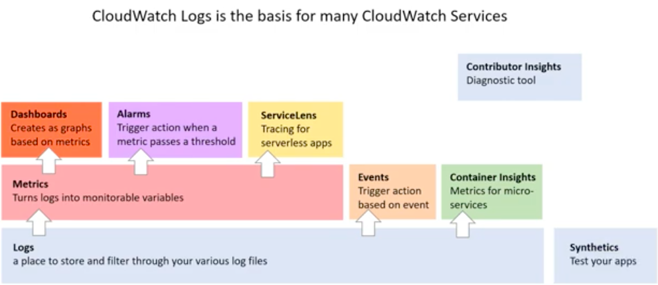

# 1.1 Implement metrics, alarms, and filters by using AWS monitoring and logging services

## 1 Identify, collect, analyze, and export logs (for example, Amazon CloudWatch Logs, CloudWatch Logs Insights, AWS CloudTrail logs).
## Cloud Watch
## Monitoring Collection
### Logs - app logs, lambda Logs 
##### Log Groups
- Created  to organize logs. Set up retention policy, add tags.
- Access using:
-- CloudWatch Logs
-- AWS CLI—The put-log-events uploads batches of log events to CloudWatch Logs.
-- Programmatically — The PutLogEvents API enables you to programmatically upload batches of log events to CloudWatch Logs. 
--- Request example: 
{
   "logEvents": [ 
      { 
         "message": "string",
         "timestamp": number
      }
   ],
   "logGroupName": "string",
   "logStreamName": "string",
   "sequenceToken": "string"
}

#### Log Stream 
- Sequence of log events being monitored;
- Each separate source of logs in CloudWatch Logs makes up a separate log stream.

#### Log Events
- Present an individual event on a log stream(log file)).  

#### Log Insights
- Allow you to interactivelly search and analyze logs in your Cloud Watch
- Discovery Fields
When reads logs generates fields that you can then use in your query.​inserts the @ symbol at the start of fields that it generates.​
Fields will be automatically generated:​
@message — the raw unparsed log event. ​
@timestamp — the event timestamp contained in the log event's timestamp field. ​
@ingestionTime — the time when the log event was received by CloudWatch Logs.​
@logStream — the name of the log stream that the log event was added to. ​
@log — is a log group identifier in the form of account-id:log-group-name.​

- Metrics - variable that is being monitored. e.g data or memory usage

- Events - trigger event based on a condition. e.g every hour take a snapshot of the server, backups? 
### Alarms - trigger notifications based on metrics when breaching a threshold.    

A CloudWatch Alarm monitors a CloudWatch Metric based on a defined threshold
Alarm breaches (goes outside the defined threshold) then it changes state

### Metric Alarm States

- OK The metric or expression is within the defined threshold
- ALARM The metric or expression is outside of the defined threshold
- INSUFFICIENT_DATA
The alarm has just started
The metric is not available
Not enough data is available
When it changes state, we can define what action it should trigger:

- ACTION THAT A CHANGE OF STATE TRIGGERS:
Notification
Auto Scaling Group
EC2 Action
You can define Conditions of either a Static or Anomaly Detection

- CONDITIONS:
Static: set a static value as the threshold eg. 100 USD
Anomaly Detection: sets a band around the data points, helps prevent false positives, more flexible if you have seasonal data
Composite Alarms: This allows you to watch multiple alarms and require both to trigger before resulting in an alarm action

The alarms being watch must have no actions sets
It is recommended to set "no action" to reduce alarm noise
You can only trigger an SNS as the action (so no EC2 or ASG actions)

Lab Running a EC2 Instance and adding alarm: https://catalog.us-east-1.prod.workshops.aws/workshops/f3a3e2bd-e1d5-49de-b8e6-dac361842e76/en-US/basic-modules/40-monitoring

-- Dashboard - visualizations graphs based on metrics provided by AWS CloudwatcH  
-- Container - collects, aggregates and summarize metrics logs from  microservices and containers   
#### Service Lens
- Consolidates logs, metrics, traces, alarms from distributed services (isolated services - microservices, containers, databases... ) in a single place.
- Service Maps displays nodes your services endpoints highlighting errors, latency...
- Integrates with CloudWatch Syntetics 
- Requirement - deploy X-Ray and Cloud Watch agent

#### Xray
Trace maps to identify services where errors are occuring, services high latency and trace unsucessful requests services  

 #### Syntetics
-  Test your apps to see if they are broken
- Use Canaries that are configurable scripts that run on a schedule to monitor your endpoints.
You can customize canary scripts to check for changes in:

-- Availability
-- Latency
-- Transactions
-- Broken or dead links
-- Step-by-step task completions
-- Page load errors
-- Load Latencies for UI assets
-- Complex wizard flows

Checkout flows in your application

-- Contributor Insights

### Observability
The ability to measure and understand how internal systems​ work. Answer questions regarding performance, tolerance,​ security, and faults with a system/application.​
- Metrics: number that is measured overtime
- Logs: text file that contains events that happened at certain time
- Traces: history of request travels through apps/services so we can pinpoint performance or failure   
-  
## 1.2 Collect metrics and logs by using the CloudWatch agent.
## 1.3 Create CloudWatch alarms.
## 1.4 Create metric filters.
## 1.5 Create CloudWatch dashboards.
## 1.6 Configure notifications (for example, Amazon Simple Notification Service [Amazon SNS], Service Quotas, CloudWatch alarms, AWS Health events)