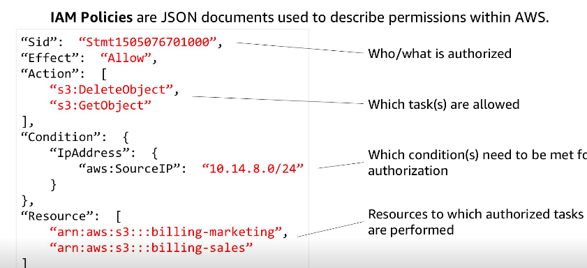
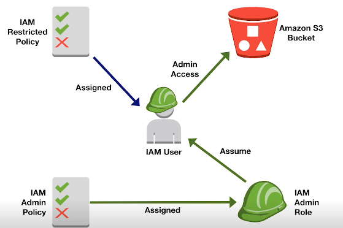

# Task Statement 3.1: Provision and maintain cloud resources

## Create and manage AMIs (for example, EC2 Image Builder)

Use yaml or json file to configure.
Auto scaling groups.
Registering your Auto Scaling group with an Elastic Load Balancing load balancer helps you to: 
set up a load-balanced application.
AMI is similar to a server image. Contains attached permission.
Permissions:

- Public - like OS images
- Private - Owner is allowed to control
- Explicite - owners grant premissions

Root Volumes:

- Drives the boot of OS

- Block devices map - determine the map of volumes

Connecting to EC2:

- 3389 - RDP - Windows. Authenticate a Private Key(local) to gain access the public key kept by Amazon.
- 22 - SSH - Linux

## Create, manage, and troubleshoot AWS CloudFormation

CloudFormation are templates to manage resources.
CloudFormation is an Infrastructure as Code (IaC) product in AWS which allows automation infrastructure creation, update and deletion.

[Cloud Formation resource and property types reference](https://docs.aws.amazon.com/AWSCloudFormation/latest/UserGuide/aws-template-resource-type-ref.html)

### Provision resources across multiple AWS Regions and accounts (for example

AWS Resource Access Manager [AWS RAM], CloudFormation StackSets, IAM
cross-account roles).

Physical X Logical Resource

LOGICAL - What you want to create.
Cloud Formation Stacks - templates are use to create stacks
StacKs are used to create physical resources

Here is the schema [CloudFormation Schema](../images/CloudFormation-Schema.png)

Select deployment scenarios and services (for example, blue/green, rolling,
canary).
Identify and remediate deployment issues (for example, service quotas, subnet
sizing, CloudFormation errors, permissions).

Deployment, Provisioning, and Automation

3.1: Provision and maintain cloud resources
Create and manage AMIs (for example, EC2 Image Builder).

### Root account

Used only to create a IAM user with administrative permissions attached via policy.

### IAM ROLE

IAM (Identity and Access Management) Role - Helps to secure control access to AWS resources. With IAM you can centrally manage permissions to which AWS resources users can access. (Implement least privilege).  
Integrate with federated services(Microsoft, Google) that will be assigned roles.
IAM user and role access to Billing information shpuld be activeted on the Account of root user to extend billing mngt option.

IAM Groups help to manage IAM users --> Create a policy to grant permission - JSON File. By default IAM users can't access anything in your account. 

Examples AWS policies - https://docs.aws.amazon.com/IAM/latest/UserGuide/access_policies_examples.html

IAM Group and Users Steps:

1. Root user create admin IAM admin user group policy
2. Root create IAM user and assign admin group to a user(s)
3. Admin user create IAM group policies
4. Admin assign/revoke policies to users
5. IAM roles can be used to assign permissions temporarily (users, applications assume roles to access resources)
See this chart as an example
    

To learn more:
Manage federated users and their permissions

### AWS Architecture

AWS have created a global public cloud platform which consists of isolated 'regions' connected together by high speed global networking.

Regions, Edge Locations and Availability Zones.

It also discusses what it means to be Globally Resilient, Regional Resilient and AZ resilient.

