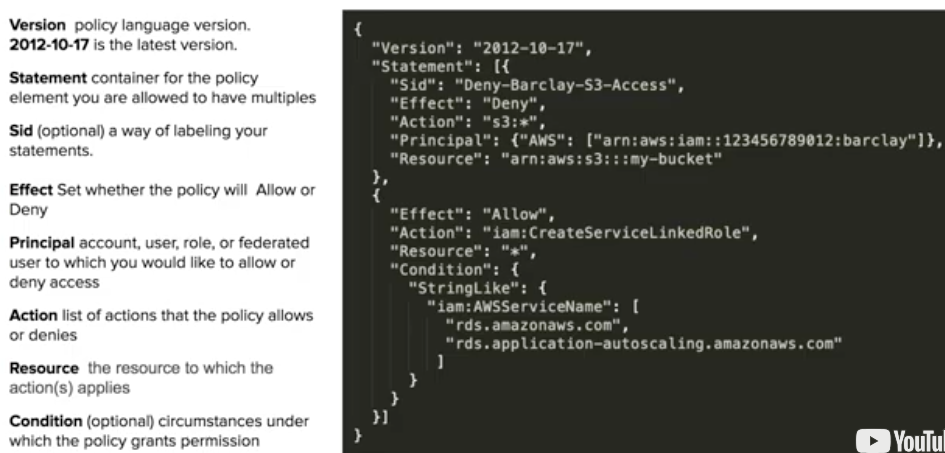
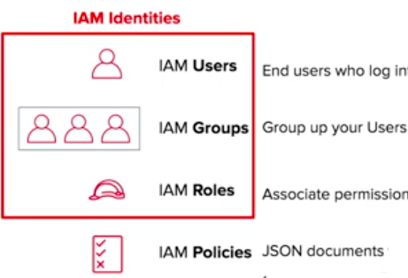
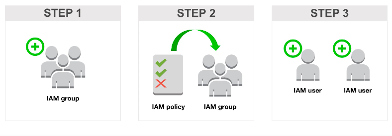

# 4.1: Implement and manage security and compliance policies

## Policy Structure

## Type of Policies

AWS Managed - you can't edit. Yellow boxes
Customer Managed - you can edit. No symbol attached
Inline policy - Directly attached to the user

## Implement IAM features

### Overview

IAM (Identity and Access Management)

* How IAM is organized*

* Implementation Steps IAM*

Policies determine witch services and what actions are allowed on that service

### Password policies

IAM > Account Settings > Password Policy
Select rules applied to passwords

### Multi-factor authentication [MFA]

Set up on IAM Identity Center

### Roles

1. Enable IAM Identity Center
2. Enable with AWS Organizations.
3. Create Group (left menu)
4. Create user

https://us-east-2.signin.aws/platform/login?workflowStateHandle=2e83b025-de5e-4a59-bf1d-ac773ab001a0
Admin Access
AWS access portal URL: https://d-9a67714fc0.awsapps.com/start, Username: dovico, One-time password: NJ<nsE_@qH!p8DyhI6&e/s/

### Add Admin Users

1. Log on IAM
2. Click on User option
3. Click on Add User
4. Select a policy...

### SAML

    - Security Access Markup Language - Allow applcation service to pass identity and secure information to AWS
    - Federated access to allow a user or application in your organization to call AWS API operations.
    - SSO to the AWS Management Console from your organization. 
More info here: https://docs.aws.amazon.com/IAM/latest/UserGuide/id_roles_providers_saml.html
    - Add a identity provider on IAM > Identity provider
        https://github.com/marketplace/actions/saml-to-assume-aws-role
    - SAML makes single sign-on (SSO) technology possible by providing a way to authenticate a user once and then communicate that authentication to multiple applications.
    - IAM Identity Center > Applications

## Federated identity

### Troubleshoot and audit access issues by using AWS services 

## CloudTrail

Monitor API Calls.
    - Where - source IP
    - When - timestamp
    - Who - User, useragent
    - What -  what service, and regions

* *Example of Cloud trail log*

### IAM Access Analyzer

Capabilities:

Identify resources in your organization and accounts that are shared with an external entity.
Identify unused access in your organization and accounts.
Validates IAM policies against policy grammar and AWS best practices.
Validate IAM policies against your specified security standards.
Generates IAM policies based on access activity in your AWS CloudTrail logs.

### IAM policy simulator.

- Select a group, a user or a role / apps and actions and run a simulation against it

### Validate service control policies (SCPs) and permissions boundaries.

- Service Control policies are available only for organizations that have all features enabled.
    - To enanle all: organizations:EnableAllFeatures
    - Organizations:DescribeOrganization – required only when using the Organizations console
- Permissions boundary
AWS supports permissions boundaries for IAM entities (users or roles). A permissions boundary is an advanced feature for using a managed policy to set the maximum permissions that an identity-based policy can grant to an IAM entity. An entity's permissions boundary allows it to perform only the actions that are allowed by both its identity-based policies and its permissions boundaries.

### Review AWS Trusted Advisor security checks.
### Validate AWS Region and service selections based on compliance requirements.
### Implement secure multi-account strategies, for example, AWS Control Tower, 

#### AWS Organizations
Account management service that enables you to consolidate multiple AWS accounts into an organization that you create and centrally manage. 

Implement Least privilege

Give access only to specific resource and specific actions

https://aws.amazon.com/blogs/security/techniques-for-writing-least-privilege-iam-policies/

### Root Account

#### BEST PRACTICES
- Use a password manager to store your encrypted password. 
- Verify your root password and MFA quarterly.
- Use group email to associate the account.

Tasks that are exclusive to root users
https://docs.aws.amazon.com/IAM/latest/UserGuide/root-user-tasks.html

#### AWS Environment Variable
Create a key on User > Security Credentials

On the client:

export AWS_ACCESS_KEY_ID=
export AWS_SECRET_ACCESS_KEY=
export AWS_DEFAULT_REGION=us-west-2 (USE "aws configure list" to find )